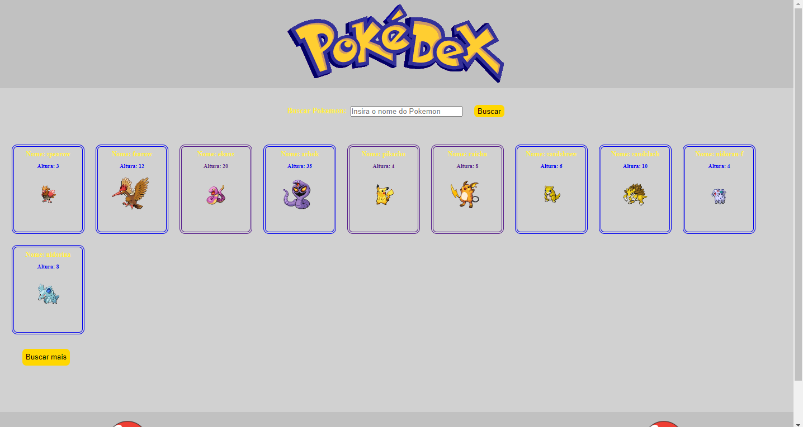
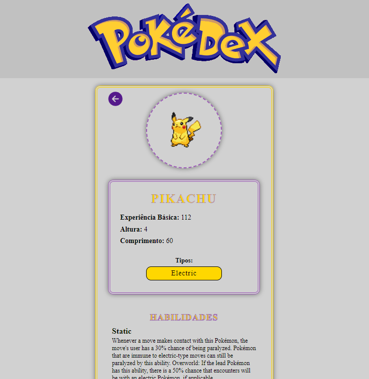

# Projeto Pokedex API
* Este projeto tem como obejetivo mostrar alguns pokemons  e seus detalhes através de uma api.

## Rodando o projeto localmente:

* Para rodar o projeto localmente é necessário ter instalado no seu computador as seguintes ferramentas:
[Node.js] (https://nodejs.org/en/)
1. Faça um clone deste repos
2. Acesse a pasta do projeto pelo terminal ou cmd
3. Instale as dependências do projeto com o comando `npm install` ou `yarn`.
4. Inicie o servidor com o comando `npm start` ou `yarn start`.

### Tecnologias utilizadas:
- NodeJS;
- React.js
- JavaScript
- CSS

* Template da pagina inicial:
* []

* Template dos detalhes dos Pokemon:
* []

